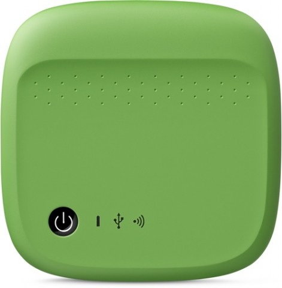

Packages for the [seagate-wireless](http://www.seagate.com/au/en/products/media-video-storage/home-media-storage/wireless/) drive.



The kernel modules are binary, because it was a pain to get the cross compile+kernel source tree to play nice and i'm not going to attempt
automating it. 

Seagate offer their GPL'd source code drop from their [support page](http://www.seagate.com/au/en/support/media-video-storage/home-media-storage/wireless/) and you should be able to compile the tree using the ti sdk (am335x-evm 05.05.00.00) kernel is `v3.2_AM335xPSP_04.06.00.09-rc2`

Older firmwares had a security bug where you were able to drop to a shell by telnetting the device with root/goflex. later firmwares this has
been patched, though they have installed sshd now. I was able to retain access by dropping a netcat shell post firmware upgrade and copying
my ssh keys over to /root/.ssh

the firmware upgrade script is at `/seagate_app/fwupgrade/bin/performFirmwareUpgrade` i added 

```
# After firmware upgrade add an init script to spawn a shell on port 1337
logUpdateMessage "Backdooring new installation"
echo -e "#!/bin/sh\nnc -p 1337 -ll -e /bin/sh &" > ${TARGET_ROOTFS_MOUNTPOINT}/etc/init.d/backdoor.sh                   
chmod +x ${TARGET_ROOTFS_MOUNTPOINT}/etc/init.d/backdoor.sh
ln -s /etc/init.d/backdoor.sh ${TARGET_ROOTFS_MOUNTPOINT}/etc/rc5.d/S99-backdoor.sh
```

Just remember to remove the link to rc5.d ;)


```
root@Wireless-LA3:~# cat /proc/cpuinfo 
Processor	: ARMv7 Processor rev 2 (v7l)
BogoMIPS	: 598.76
Features	: swp half thumb fastmult vfp edsp thumbee neon vfpv3 tls 
CPU implementer	: 0x41
CPU architecture: 7
CPU variant	: 0x3
CPU part	: 0xc08
CPU revision	: 2

Hardware	: am335xevm
Revision	: 0000
Serial		: 0000000000000000
```

```
root@Wireless-LA3:~# mtdinfo -a
Count of MTD devices:           10
Present MTD devices:            mtd0, mtd1, mtd2, mtd3, mtd4, mtd5, mtd6, mtd7, mtd8, mtd9
Sysfs interface supported:      yes

mtd0
Name:                           X-Loader
Type:                           nand
Eraseblock size:                131072 bytes, 128.0 KiB
Amount of eraseblocks:          4 (524288 bytes, 512.0 KiB)
Minimum input/output unit size: 2048 bytes
Sub-page size:                  2048 bytes
OOB size:                       64 bytes
Character device major/minor:   90:0
Bad blocks are allowed:         true
Device is writable:             true

mtd1
Name:                           U-Boot
Type:                           nand
Eraseblock size:                131072 bytes, 128.0 KiB
Amount of eraseblocks:          4 (524288 bytes, 512.0 KiB)
Minimum input/output unit size: 2048 bytes
Sub-page size:                  2048 bytes
OOB size:                       64 bytes
Character device major/minor:   90:2
Bad blocks are allowed:         true
Device is writable:             true

mtd2
Name:                           Boot-ARGS
Type:                           nand
Eraseblock size:                131072 bytes, 128.0 KiB
Amount of eraseblocks:          1 (131072 bytes, 128.0 KiB)
Minimum input/output unit size: 2048 bytes
Sub-page size:                  2048 bytes
OOB size:                       64 bytes
Character device major/minor:   90:4
Bad blocks are allowed:         true
Device is writable:             true

mtd3
Name:                           Factory-Settings
Type:                           nand
Eraseblock size:                131072 bytes, 128.0 KiB
Amount of eraseblocks:          2 (262144 bytes, 256.0 KiB)
Minimum input/output unit size: 2048 bytes
Sub-page size:                  2048 bytes
OOB size:                       64 bytes
Character device major/minor:   90:6
Bad blocks are allowed:         true
Device is writable:             true

mtd4
Name:                           firmware-detail
Type:                           nand
Eraseblock size:                131072 bytes, 128.0 KiB
Amount of eraseblocks:          1 (131072 bytes, 128.0 KiB)
Minimum input/output unit size: 2048 bytes
Sub-page size:                  2048 bytes
OOB size:                       64 bytes
Character device major/minor:   90:8
Bad blocks are allowed:         true
Device is writable:             true

mtd5
Name:                           kernel-1
Type:                           nand
Eraseblock size:                131072 bytes, 128.0 KiB
Amount of eraseblocks:          40 (5242880 bytes, 5.0 MiB)
Minimum input/output unit size: 2048 bytes
Sub-page size:                  2048 bytes
OOB size:                       64 bytes
Character device major/minor:   90:10
Bad blocks are allowed:         true
Device is writable:             true

mtd6
Name:                           kernel-2
Type:                           nand
Eraseblock size:                131072 bytes, 128.0 KiB
Amount of eraseblocks:          40 (5242880 bytes, 5.0 MiB)
Minimum input/output unit size: 2048 bytes
Sub-page size:                  2048 bytes
OOB size:                       64 bytes
Character device major/minor:   90:12
Bad blocks are allowed:         true
Device is writable:             true

mtd7
Name:                           ubifs-1
Type:                           nand
Eraseblock size:                131072 bytes, 128.0 KiB
Amount of eraseblocks:          800 (104857600 bytes, 100.0 MiB)
Minimum input/output unit size: 2048 bytes
Sub-page size:                  2048 bytes
OOB size:                       64 bytes
Character device major/minor:   90:14
Bad blocks are allowed:         true
Device is writable:             true

mtd8
Name:                           ubifs-2
Type:                           nand
Eraseblock size:                131072 bytes, 128.0 KiB
Amount of eraseblocks:          800 (104857600 bytes, 100.0 MiB)
Minimum input/output unit size: 2048 bytes
Sub-page size:                  2048 bytes
OOB size:                       64 bytes
Character device major/minor:   90:16
Bad blocks are allowed:         true
Device is writable:             true

mtd9
Name:                           Reserved
Type:                           nand
Eraseblock size:                131072 bytes, 128.0 KiB
Amount of eraseblocks:          356 (46661632 bytes, 44.5 MiB)
Minimum input/output unit size: 2048 bytes
Sub-page size:                  2048 bytes
OOB size:                       64 bytes
Character device major/minor:   90:18
Bad blocks are allowed:         true
Device is writable:             true
```
